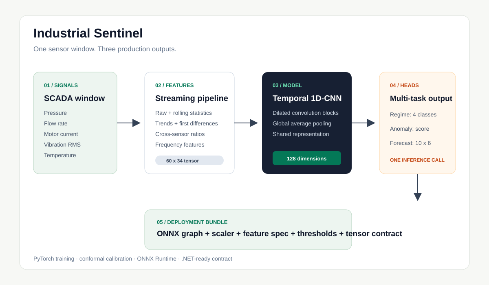

<!-- markdownlint-disable MD001 MD013 MD033 MD041 -->
<div align="center">

# Industrial Sentinel

### Multi-task predictive maintenance from sensor stream to deployable ONNX model

[Live product](https://industrial-sentinel.vercel.app) ·
[Portfolio](https://relinxx.vercel.app/projects/industrial-sentinel) ·
[Deployment guide](DEPLOYMENT.md)


</div>

Industrial Sentinel is an end-to-end machine-learning pipeline for monitoring pumps, motors, and compressors. It transforms six raw sensor channels into 34 leakage-safe features, learns temporal behavior with a shared 1D-CNN, and produces three predictions in one inference call:

- operating regime classification
- calibrated anomaly scoring
- short-horizon sensor forecasting

The trained model exports to a single ONNX graph with a machine-readable inference contract for .NET integration. The [live product](https://industrial-sentinel.vercel.app) is a lightweight operator-facing companion that demonstrates multi-signal analysis, fault evidence, severity, and health forecasting.

## Verified model results

Metrics are loaded from the committed evaluation artifacts over 107,992 test samples.

| Task | Metric | Result |
| --- | --- | ---: |
| Regime classification | Macro F1 | **0.9961** |
| Regime classification | Accuracy | **99.92%** |
| Anomaly detection | AUROC | **0.9994** |
| Anomaly detection | AUPRC | **0.9990** |
| Anomaly detection | Precision at 95% recall | **1.0000** |
| Deployment | ONNX model size | **39.3 KB** |
| Deployment | CPU inference | **~5 ms** |

The test split contains 84 misclassifications across Healthy, Cavitation, Bearing Wear, and Seal Leak regimes.

## Architecture



1. A physics-informed simulator produces six SCADA-style channels at 1 Hz.
2. The feature pipeline creates raw, rolling, trend, delta, ratio, and frequency features using past values only.
3. Sixty-step windows enter a dilated 1D-CNN backbone.
4. Three task heads share the learned 128-dimensional representation.
5. Split conformal calibration determines anomaly thresholds.
6. Export produces one ONNX graph plus scaler, feature, threshold, and tensor contracts.

## Sensor surface

| Sensor | Unit | Useful fault signal |
| --- | --- | --- |
| Discharge pressure | bar | Cavitation and seal behavior |
| Suction pressure | bar | Cavitation |
| Flow rate | m3/h | Seal leak and blockage |
| Motor current | A | Bearing wear and overload |
| Vibration RMS | mm/s | Bearing wear and imbalance |
| Bearing temperature | C | Wear and lubrication loss |

## Model design

```text
Input: (batch, 60 timesteps, 34 features)
  -> Dilated Conv1D backbone
  -> Global average pooling
  -> Shared 128-dimensional representation
     |-- Regime head: 4-class logits
     |-- Anomaly head: probability [0, 1]
     `-- Forecast head: 10 steps x 6 sensors
```

The combined objective weights classification, anomaly detection, and forecasting while keeping all three outputs in one deployable graph.

## Production-minded details

- Rolling features use past observations only and are covered by leakage tests.
- A LightGBM baseline provides a non-neural comparison and feature-importance view.
- Split conformal calibration replaces arbitrary global anomaly cutoffs.
- The ONNX bundle includes preprocessing and tensor contracts, not just model weights.
- Tests cover feature engineering, model behavior, export parity, and contracts.
- The deployment guide includes a C# ONNX Runtime integration path.

## Repository structure

```text
.
|-- sentinel/
|   |-- datagen/              # Physics-informed SCADA simulator
|   |-- features/             # 34-feature streaming pipeline
|   |-- models/               # Multi-task CNN and baseline
|   |-- calibrate/            # Conformal thresholding
|   `-- export/               # ONNX and contract generation
|-- artifacts/                # Model, metrics, scaler, and contracts
|-- configs/train.yaml
|-- tests/                    # 59 focused tests
|-- train.py
|-- evaluate.py
|-- docs/architecture.svg
|-- DEPLOYMENT.md
`-- README.md
```

## Quick start

```powershell
git clone https://github.com/relinxx/Industrial-Sentinel.git
cd Industrial-Sentinel
python -m venv .venv
.\.venv\Scripts\Activate.ps1
python -m pip install -r requirements.txt
```

Train a quick run:

```powershell
python train.py --sim_hours 10 --epochs 20
```

Evaluate:

```powershell
python evaluate.py --checkpoint artifacts/sentinel_best.pt --data simulate --sim_hours 50
```

Export:

```powershell
python -m sentinel.export.onnx_export
```

Test:

```powershell
python -m pytest tests -v
```

## Deployment artifacts

| Artifact | Contract |
| --- | --- |
| `sentinel.onnx` | Single-graph inference |
| `inference_contract.json` | Input/output shapes, labels, and runtime notes |
| `feature_spec.json` | Ordered feature definitions |
| `scaler_config.json` | Standardization parameters |
| `thresholds.json` | Calibrated anomaly thresholds |
| `test_metrics.json` | Reproducible evaluation results |

See [DEPLOYMENT.md](DEPLOYMENT.md) for the complete ONNX Runtime and .NET path.

## Author

Built by [Syed Muhammad Rehan](https://www.linkedin.com/in/relinxx), an AI-focused software engineer working across applied ML, intelligent agents, RAG, and production software systems.
